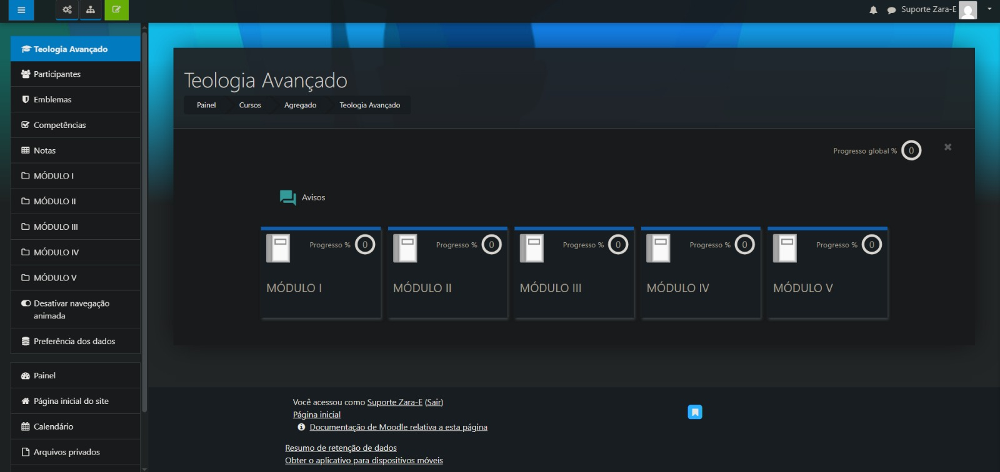

# EdTech FullStack LMS Ecosystem

Full Stack LMS platform inspired by real-world EdTech environments, focused on educational management, authentication flows, API integrations and scalable web applications.

## Technologies

* React
* Node.js
* TypeScript
* MySQL
* REST APIs
* JWT Authentication
* Moodle
* WordPress

## Features

* User authentication
* Course management
* Admin dashboard
* Educational platform structure
* API integrations
* Responsive interface
* Database integration
* Modular architecture

## Project Goals

This project was developed to simulate a modern Learning Management System (LMS) ecosystem used in EdTech platforms, applying real-world concepts such as authentication, modular systems, educational flows and scalable web development.

## Screenshots

### Home Page


### Login Page


### Dashboard



## Running the Project

```bash id="x95v6n"
npm install
npm run dev
```

## Author

Gabriel Soares
Full Stack Developer
